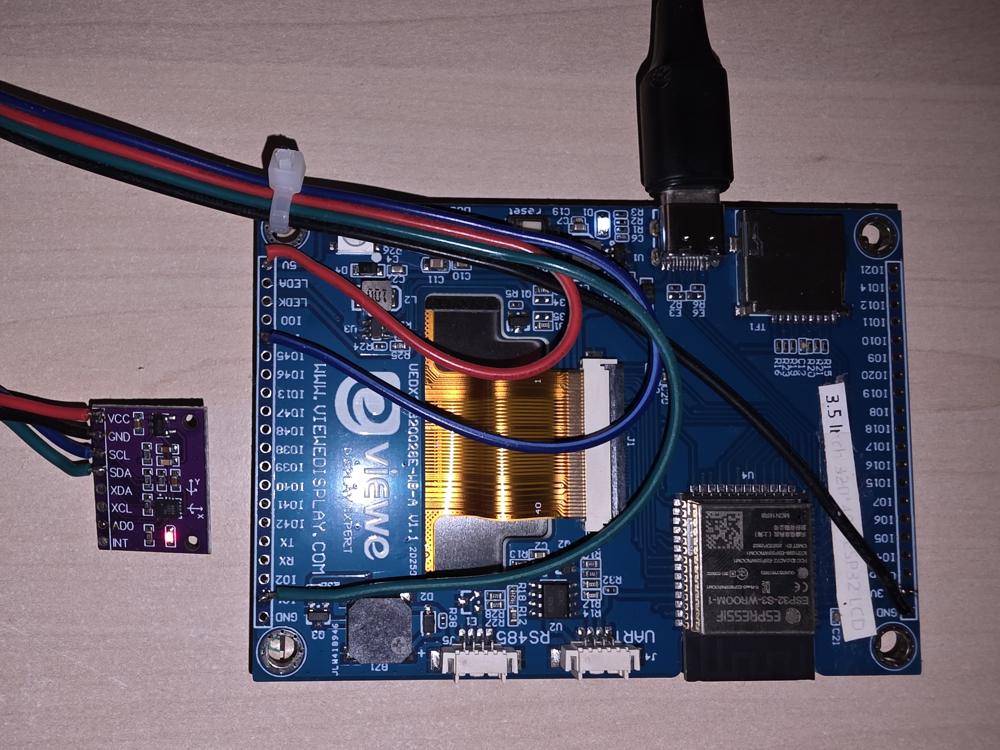
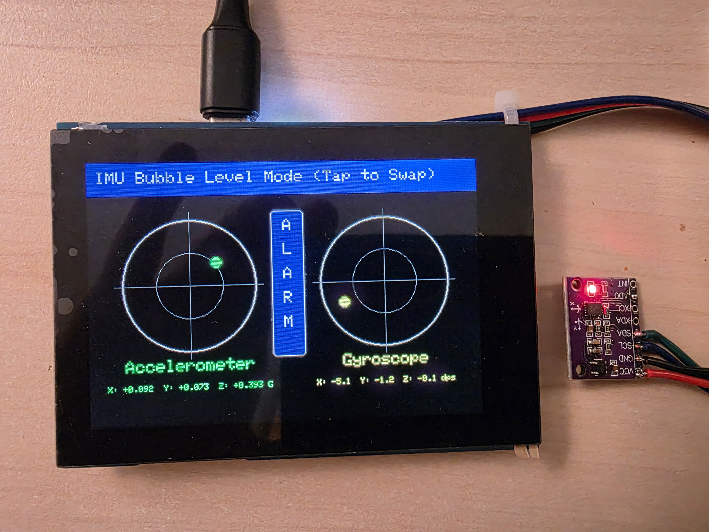
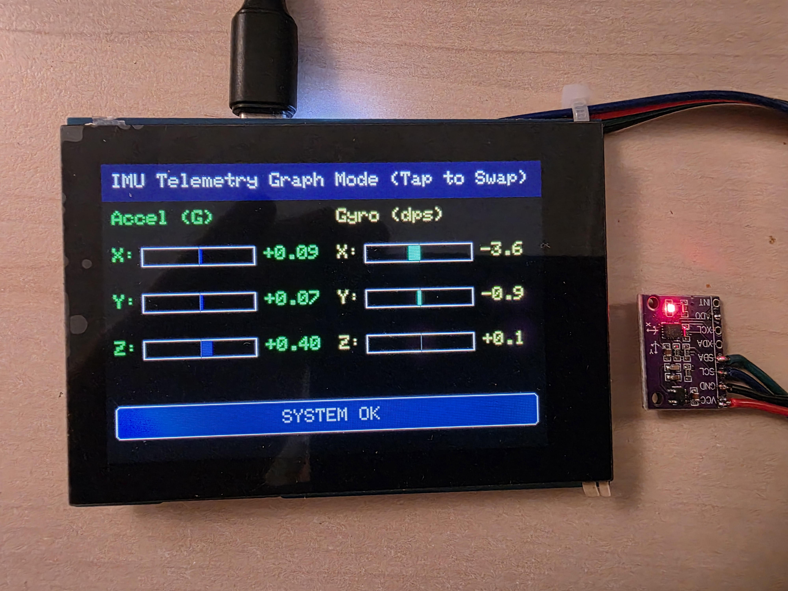
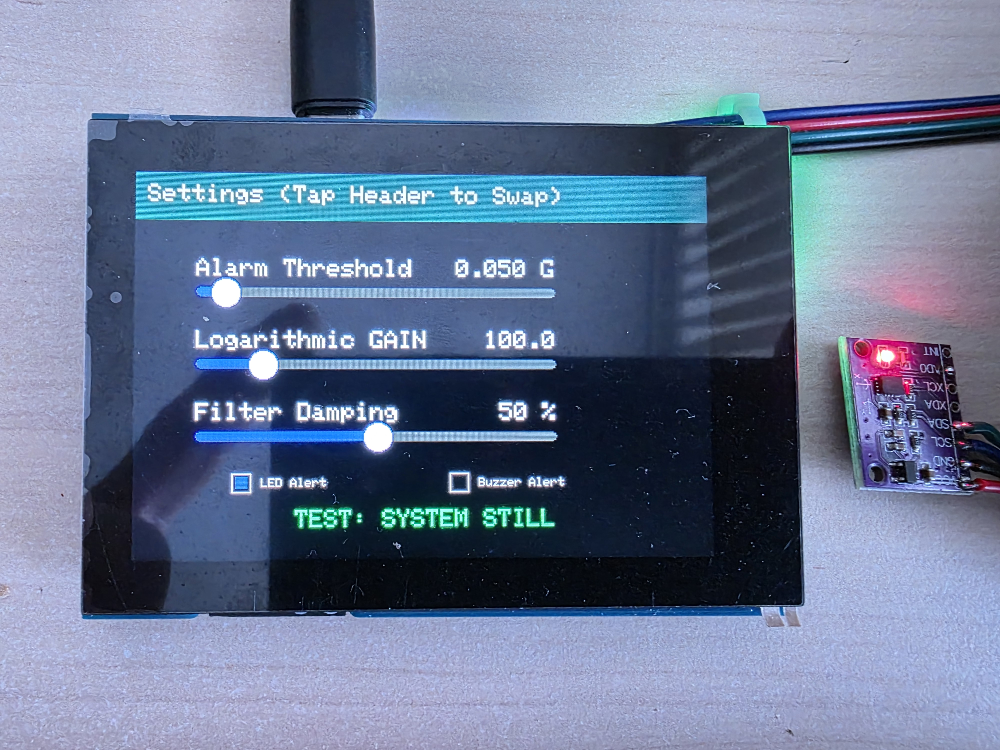

# Viewe 3.5" ESP32-S3 Seismograph & Level HMI

This project turns a **Viewe 3.5" ESP32-S3 Board** (`UEDX32480035E-WB-A` v1.0, 320x480) into an ultra-sensitive seismograph, telemetry graph, and bubble level utilizing a **QMI8658 IMU** and LovyanGFX under ESP-IDF.

original Viewe Github
https://github.com/VIEWESMART/UEDX24320028ESP32-3.5inch-320_480-Display/tree/main

---






## 🔌 Hardware Pinout (Wiring Diagram)

The board routes display, touch, and IMU peripherals to the ESP32-S3 as follows:

### 1. SPI Display (ST7796 / ST7365P)
* **SCK / SCLK**: `GPIO 40`
* **MOSI**: `GPIO 45`
* **MISO**: Unused (`-1`)
* **DC (LCD RS)**: `GPIO 41`
* **CS**: `GPIO 42`
* **RST**: `GPIO 39`
* **Backlight (BL-IN)**: `GPIO 13` (PWM dimming)
* **IM0 / IM1**: `GPIO 47` and `GPIO 48` (Both set to `1` / HIGH for 4-line SPI interface configuration)

### 2. Shared I2C Port 0 (Touch & IMU)
* **SDA**: `GPIO 1`
* **SCL**: `GPIO 3`
* **Bus Speed**: `400 kHz`

### 3. Touch Controller (CHSC6540 / FT5x06 compatible)
* **I2C Address**: `0x2E`
* **INT**: `GPIO 4`
* **RST**: `GPIO 2` (Active-low, toggled for 20ms at boot to wake the chip)

### 4. IMU Sensor (QMI8658)
* **I2C Address**: `0x6B` (primary) or `0x6A` (secondary fallback)

### 5. Physical Signaling Peripherals
* **Addressable WS2812B RGB LED**: `GPIO 0` (standard GRB color sequence)
* **Low-Pitch Piezo Buzzer**: `GPIO 38` (driven via LEDC PWM Timer 1 / Channel 1 at 500 Hz)

---

## 🛠️ Software Tricks & DSP Implementation

### 1. Touch 16-bit Parsing & Event Masking
* **The Problem**: The CHSC6540 sends coordinates as 12-bit values packed into 16-bit registers. The top 4 bits contain touch event flags (e.g. `0x80` for "active contact"). Without masking, the parsed coordinates corrupted into values like `32827`, completely breaking LovyanGFX's internal display rotation mapping.
* **The Fix**: Masked the coordinate high-byte in `Touch_CHSC6x.cpp`:
  ```cpp
  uint16_t raw_x = ((data[3] & 0x0F) << 8) | data[4];
  uint16_t raw_y = ((data[5] & 0x0F) << 8) | data[6];
  ```

### 2. Quick Tap Capture (Release Delay Tuning)
* **The Problem**: Cap touch controllers pull the INT pin LOW briefly. If the main loop is busy drawing a frame (taking ~100ms), the finger is already gone and the INT pin is HIGH by the time the loop polls touch coordinates.
* **The Fix**: Increased the release delay in the touch driver from 50 ms to 300 ms (`_delay_ms = 300`). Now, the driver "remembers" coordinates for 300 ms after the physical touch ends, allowing the main task to reliably capture brief taps.

### 3. Single-Threaded Polling (60 Hz)
* **The Problem**: LovyanGFX is not thread-safe. Accessing display drawing (SPI) on Core 0 and touch coordinates (I2C) inside a separate task on Core 1 caused race conditions and locked up the display.
* **The Fix**: Removed interrupts and multi-threading for touch. Instead, the main loop polls `lcd.getTouch()` at 60 Hz. The driver performs a near-instant GPIO check on the INT pin first. If no touch is detected, it exits immediately without executing slow I2C reads.

### 4. Seismograph DSP Engine (Core 1, 500 Hz)
* **The Problem**: Static gravity ($1g$ downwards) triggers false alarms if the device tilts. Reading the IMU at the screen refresh rate (10 Hz) misses high-frequency structural vibrations (footsteps, tapping).
* **The Fix**: Created a dedicated high-priority `imu_sampling_task` on Core 1 running at **500 Hz** (2 ms intervals).
  * **Sensitivity**: Set QMI8658 to its most sensitive range: **$\pm 2g$** for accelerometer ($16384 \text{ LSB/g}$) and **$\pm 16^\circ/\text{s}$** for gyroscope ($2048 \text{ LSB/dps}$).
  * **DC Drift/Gravity Filter**: Applied an Exponential Moving Average (EMA) high-pass filter:
    $$\text{EMA} = \alpha \cdot \text{sample} + (1 - \alpha) \cdot \text{EMA}$$
    $$\text{AC Vibration} = \text{sample} - \text{EMA}$$
    This filters out static gravity/tilt, allowing you to tilt the board freely without triggering false alarms.
  * **Slider 3 (Filter Damping)**: Directly maps to the integration factor $\alpha$, letting you tune the seismograph's sensitivity to slow vs. fast vibrations.
  * **Peak-Hold Envelope**: Evaluates the vibration amplitude using a fast peak-hold envelope with exponential decay ($0.992$ coefficient at 500Hz), which decays smoothly for optimal visual telemetry.

### 5. Advanced UI Dragging (Clamping & Precise Heights)
* **Page Toggle**: Tap the header ($Y < 40$) to loop through pages.
* **Slider Tracking**: Target zones are mapped precisely around the visual centers of the four sliders at $\pm 15$ pixels to avoid dead zones.
* **Horizontal Clamping**: Dragging coordinates $tx$ are geoclamped to the track width ($50$ to $350$). Even if you drag your finger off the slider horizontally, it stays locked and smoothly limits to $0\%$ or $100\%$.

---

## 📖 How to Operate

1. **Page 0 (Bubble Level)**: High-resolution log-scaled accelerometer and gyroscope level circles. The center displays a vertical visual ALARM bar.
2. **Page 1 (Graphs)**: Real-time AC vibration bar graphs for X, Y, Z axes, with a large horizontal "ALARM TRIGGERED / SYSTEM OK" status bar.
3. **Page 2 (Settings)**:
   * **Slider 1 (Alarm Threshold - G)**: Set accelerometer alarm limit with milligravity precision (**`0.010 G` to `0.500 G`**).
   * **Slider 2 (Alarm Threshold - DPS)**: Set gyroscope alarm limit with degrees per second precision (**`1.0 DPS` to `50.0 DPS`**).
   * **Slider 3 (Logarithmic GAIN)**: Adjust bubble level visual zoom sensitivity (`10.0` to `500.0`).
   * **Slider 4 (Filter Damping)**: Adjust the integration strength (`0%` to `100%`) of the seismic high-pass filter.
   * **LED Alert Checkbox**: Toggles the WS2812B alert (Green = Normal, Red = Alarm, Unchecked = Disabled/Dark). Enabled by default.
   * **Buzzer Alert Checkbox**: Toggles the low-pitch pulsed alarm beep (500 Hz). Disabled by default.
 
